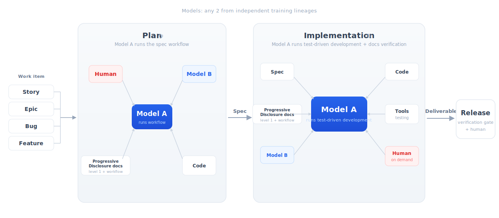
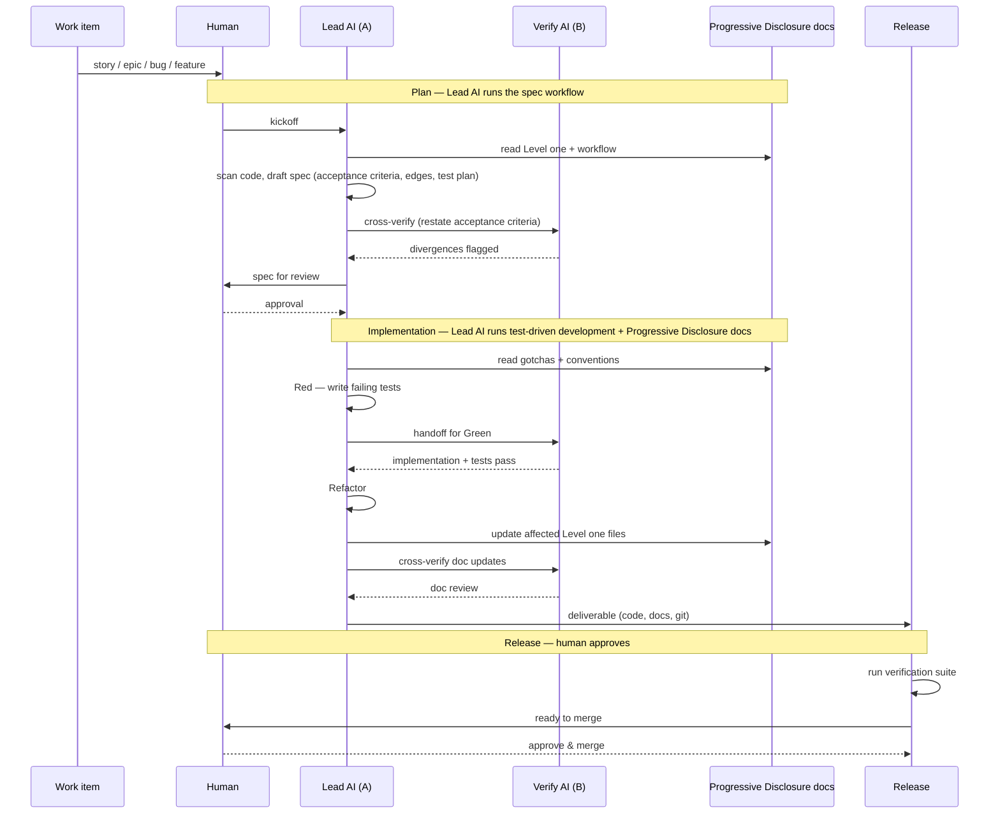

# AI DevKit

**An operating model for AI-centric software engineering.**

AI DevKit publishes standards and workflow templates for AI-centric software engineering — a model in which AI agents do the bulk of execution work and humans make the highest-leverage decisions. It combines a documentation standard (Progressive Disclosure docs) with a multi-model lifecycle that runs from work intake to release.

## The AI Software Development Lifecycle

AI DevKit publishes standards. The diagrams below depict the lifecycle those standards enable inside an adopting repo.



*Work flows from intake (story, epic, bug, or feature) through Plan, Implementation, and Release. The Lead AI executes the workflow; the Verify AI independently reviews all Lead AI work. The Plan phase produces a spec; the Implementation phase produces working code, tests, and updated docs.*



*The same flow shown as interactions. The Lead AI reads and updates Progressive Disclosure docs at each phase boundary, and the Verify AI reviews all Lead AI work independently.*

## Lead AI and Verify AI

**Lead AI** executes the workflow — it reads the procedure from Progressive Disclosure docs and works through it step by step. **Verify AI** independently reviews all Lead AI work — it's a second AI from a different training lineage.

Which provider takes which role can vary per phase and per repo. What matters is that the two AIs come from independent training lineages. A single AI is confidently wrong in ways invisible to itself, and asking the same model to review its own output rarely catches the error. Two independent lineages catch different mistakes.

## Plan

**What it is.** Plan turns a work item — story, epic, bug, or feature — into an approved spec: a short markdown file with acceptance criteria, edge cases, approach decisions, and a test plan. The human approves the spec before any code is written.

**How it works.** Lead AI executes the spec-creation workflow from the adopting repo's `docs/ai/L1/05_workflows.md`. The workspace draws on the work item, the relevant Progressive Disclosure docs, existing code, and the human. The workflow includes explicit cross-verification steps that consult Verify AI — for example, having Verify AI independently restate the acceptance criteria to surface ambiguities. The phase ends when the human signs off the spec.

**Artifact.** `docs/specs/SPEC-NNN-<short-name>.md` — title, status, acceptance criteria, edge cases, approach decisions, test cases, out-of-scope list, verification plan, and notes. See [spec-profile.md](docs/standard/spec-profile.md) for the template and the nine principles a good spec must satisfy.

<details>
<summary>Spec prompt</summary>

Draft or update a spec. Chain with a verify prompt for cross-model review.

```bash
# Claude as lead
curl -sL https://raw.githubusercontent.com/AgoraIO-Community/ai-devkit/main/prompts/spec.md \
  | claude --dangerously-skip-permissions

# Codex as lead
codex --full-auto "$(curl -sL \
  https://raw.githubusercontent.com/AgoraIO-Community/ai-devkit/main/prompts/spec.md)"
```

> Standalone file: `prompts/spec.md`

</details>

## Implementation

**What it is.** Implementation turns an approved spec into a deliverable bundle: code, tests, updated Progressive Disclosure docs, and the structured commit message. The human is available on demand for clarifications but is not in the inner loop.

**How it works.** Lead AI executes the implementation workflow from the adopting repo's `docs/ai/L1/05_workflows.md`. The workspace draws on the spec, the existing code, Progressive Disclosure docs, the testing tools, the human (on demand), and Verify AI. The workflow runs Red, Green, Refactor for the test-driven development discipline and then Progressive Disclosure docs verification, with cross-verification steps that involve Verify AI at key transitions. For test-driven development specifically, the workflow specifies a handoff: one model writes the failing tests, a second model from an independent training lineage implements — preserving test-author and implementer separation.

Once implementation is complete, the affected Progressive Disclosure docs are updated to reflect the new reality and the spec is archived to `docs/specs/archive/`. Archived specs are not part of the agent operating surface — Progressive Disclosure docs carry everything an agent needs going forward. The archive exists for human audits and retrospectives.

**Artifact.** Test files, code changes, updated Progressive Disclosure docs, and a structured commit message. See [spec-profile.md](docs/standard/spec-profile.md) for the canonical workflows.

<details>
<summary>Implement prompt</summary>

Start or continue implementation from a spec using test-driven development. Chain with a verify prompt for cross-model review.

```bash
# Claude as lead
curl -sL https://raw.githubusercontent.com/AgoraIO-Community/ai-devkit/main/prompts/implement.md \
  | claude --dangerously-skip-permissions

# Codex as lead
codex --full-auto "$(curl -sL \
  https://raw.githubusercontent.com/AgoraIO-Community/ai-devkit/main/prompts/implement.md)"
```

> Standalone file: `prompts/implement.md`

</details>

## Release

**What it is.** The verification gate before deploy. Release is the human's second checkpoint — after spec approval at the front.

**How it works.** The deliverable bundle is pushed to a release branch where continuous integration runs the full verification suite: tests, lints, doc-freshness checks against the eight Level one files, and spec-to-test traceability checks. The release mechanism downstream of continuous integration is system-dependent and outside AI DevKit's scope — teams can auto-promote on green, route through human review, or use any other release model they prefer.

**Artifact.** The release branch, continuous integration workflow, merge record back to the spec via the structured commit message convention (see [spec-profile.md](docs/standard/spec-profile.md#commit-and-pr-convention)), and the archived spec.

## AI Dev Environment

**What it is.** One workspace where the AI can run the whole system end to end. When a system spans multiple repos — an API, an SDK, a frontend, shared infrastructure — the Lead AI needs to run, stop, and test everything from a single place.

**How it works.** It's a container of containers. The outer container is the workspace. Inside it, each component runs in its own container, managed by docker-compose. Infrastructure dependencies (databases, caches, message queues) also run as containers. The Lead AI can start, stop, restart, and test any component without leaving the workspace.

The whole thing runs locally or in the cloud. Cloud workspaces are useful for team handoff — another engineer picks up the same workspace and the same agent context. The environment includes built-in tooling: Playwright for browser testing, Terraform for infrastructure provisioning. All agent sessions are audited — giving you reproducibility, traceability, and evals for debugging agent behaviour.

The system repo contains a system card (`docs/ai/SYSTEM.md`) that lists which repos belong to the system, how they connect, and what contracts they share. Component repos are cloned into a `components/` directory inside the dev environment. Changes to component code are reflected immediately via volume mounts.

**Artifact.** A system repo with `System Role: system` in the Level zero card, `SYSTEM.md` alongside it, docker-compose config, devcontainer config, and setup/start/stop/test scripts. See [system-profile.md](docs/standard/system-profile.md) for the full profile.

## Progressive Disclosure docs

**What it is.** Progressive Disclosure docs give every repository a consistent operating surface for AI agents. They are read at the start of every phase to orient Lead AI, and updated at the end of every cycle to reflect the new reality. They are the substrate the lifecycle runs on, and the place where each adopting repo's localised workflow templates live.

**How it works.** Each repository has three tiers:

- **Level zero** — a 300–500 token identity card (`docs/ai/L0_repo_card.md`)
- **Level one** — eight fixed structured summary files in `docs/ai/L1/`
- **Level two** — on-demand deep dives under `docs/ai/L1/L2/`

The eight Level one files are the minimum complete operating surface for an AI agent:

| File              | Agent question it answers              |
| ----------------- | -------------------------------------- |
| `01_setup`        | How do I run this?                     |
| `02_architecture` | How is this shaped?                    |
| `03_code_map`     | Where do I edit?                       |
| `04_conventions`  | How do we write code here?             |
| `05_workflows`    | How do I perform this task?            |
| `06_interfaces`   | What contracts must I preserve?        |
| `07_gotchas`      | What will break if I touch it naively? |
| `08_security`     | What trust boundaries must I respect?  |

These eight categories define the minimum complete operating surface an AI agent needs to work safely in any repository. They cover orientation, local engineering practice, contracts, tribal knowledge, and security boundaries. The set is deliberately fixed so agents, tooling, prompts, and reviewers can rely on a consistent structure across an organisation, while repo-specific depth is handled through Level two.

**Workflows are part of Progressive Disclosure docs.** Each adopting repo's `05_workflows.md` carries the spec-creation, implementation, and Progressive Disclosure docs verification workflows — materialised from ai-devkit's canonical templates at bootstrap, with repo-specific tooling filled in. This is what Lead AI executes during Plan and Implementation.

**Artifact.** `AGENTS.md` at the repo root, `docs/ai/L0_repo_card.md`, and the eight Level one files. Optional `docs/ai/RECIPE.md` for reusable starter repos. See [progressive-disclosure-standard.md](docs/standard/progressive-disclosure-standard.md) for the full standard.

<details>
<summary>Create docs</summary>

Generate Progressive Disclosure docs for a repo that doesn't have them yet.
Chain with a verify prompt for cross-model review.

```bash
# Claude as lead
curl -sL https://raw.githubusercontent.com/AgoraIO-Community/ai-devkit/main/prompts/create-docs.md \
  | claude --dangerously-skip-permissions

# Claude as lead + Codex verify
curl -sL https://raw.githubusercontent.com/AgoraIO-Community/ai-devkit/main/prompts/create-docs.md \
     https://raw.githubusercontent.com/AgoraIO-Community/ai-devkit/main/prompts/verify-codex.md \
  | claude --dangerously-skip-permissions

# Codex as lead + Claude verify
codex --full-auto "$(curl -sL \
  https://raw.githubusercontent.com/AgoraIO-Community/ai-devkit/main/prompts/create-docs.md \
  https://raw.githubusercontent.com/AgoraIO-Community/ai-devkit/main/prompts/verify-claude.md)"
```

> Standalone file: `prompts/create-docs.md`

</details>

<details>
<summary>Update docs</summary>

Update existing Progressive Disclosure docs after code or convention changes.

```bash
# Claude as lead
curl -sL https://raw.githubusercontent.com/AgoraIO-Community/ai-devkit/main/prompts/update-docs.md \
  | claude --dangerously-skip-permissions

# Codex as lead
codex --full-auto "$(curl -sL \
  https://raw.githubusercontent.com/AgoraIO-Community/ai-devkit/main/prompts/update-docs.md)"
```

> Standalone file: `prompts/update-docs.md`

</details>

## Verify prompts

Verification uses a second AI from a different training lineage to independently review the Lead AI's work. Chain a verify prompt after any work prompt:

```bash
# Claude as lead, Codex as verify
curl -sL https://raw.githubusercontent.com/AgoraIO-Community/ai-devkit/main/prompts/create-docs.md \
     https://raw.githubusercontent.com/AgoraIO-Community/ai-devkit/main/prompts/verify-codex.md \
  | claude --dangerously-skip-permissions

# Codex as lead, Claude as verify
codex --full-auto "$(curl -sL \
  https://raw.githubusercontent.com/AgoraIO-Community/ai-devkit/main/prompts/create-docs.md \
  https://raw.githubusercontent.com/AgoraIO-Community/ai-devkit/main/prompts/verify-claude.md)"
```

The verify prompt tells the Lead AI how to shell out to the Verify AI, parse findings, fix them, and re-verify — up to 3 rounds with zero human intervention. Any work prompt can be chained with either verify prompt.

<details>
<summary>verify-codex.md</summary>

Use when Claude is the Lead AI. Requires [Codex CLI](https://github.com/openai/codex) installed and on PATH.

> Standalone file: `prompts/verify-codex.md`

</details>

<details>
<summary>verify-claude.md</summary>

Use when Codex is the Lead AI. Requires [Claude Code](https://github.com/anthropics/claude-code) installed and on PATH.

> Standalone file: `prompts/verify-claude.md`

</details>

**All six prompts.** The full set lives in `prompts/`:

| File | Purpose |
|---|---|
| `create-docs.md` | Generate Progressive Disclosure docs from scratch |
| `update-docs.md` | Update existing docs after code changes |
| `spec.md` | Draft or update a spec |
| `implement.md` | Start or continue implementation from spec (TDD) |
| `verify-codex.md` | Chain: use Codex as Verify AI |
| `verify-claude.md` | Chain: use Claude as Verify AI |

## Getting started

Three adoption levels, each moving further along the AI-centric axis.

**Just legibility (still AI-assisted).** Add `AGENTS.md` and `docs/ai/` to a single repo using the Create docs prompt above. Agents can now read the repo; humans still do the engineering.

**Spec-driven development (partially AI-centric).** Add `docs/specs/` and adopt the spec template for new work. Pair an AI agent with the test-driven development discipline.

**Full multi-model flow (fully AI-centric).** Configure two model providers, adopt the Plan → Implementation → Release cycle with cross-verification at every phase, route a release branch through doc-freshness verification. This is the diagram's operating model.

## Profiles

**Recipe profile.** Use [docs/standard/recipe-profile.md](docs/standard/recipe-profile.md)
when a repo is a reusable starter that should publish extension points and
support child verticals. The profile is optional — repos without
`Recipe Role` in the Level zero card are unaffected. See [examples/recipe-base](examples/recipe-base/README.md) and
[examples/recipe-vertical](examples/recipe-vertical/README.md) for
structural fixtures.

**System profile.** Use [docs/standard/system-profile.md](docs/standard/system-profile.md)
when a repo describes a multi-component system and provides a containerised
dev environment. The profile is optional — repos without `System Role` in
the Level zero card are unaffected.

## Compatibility

Compatibility is capability-based, not absolute. Any tool that reads repo
files can consume `AGENTS.md` and `docs/ai/`.

- **Claude Code** — tested; plain markdown plus multi-agent review
- **Cursor** — tested; plain markdown consumption
- **Codex** — tested; plain markdown plus CLI reviewer role
- **Gemini** — untested; plain markdown consumption expected to work
- **Other tools** — expected to work if the tool reads repo files

## Repository contents

- `docs/standard/` — the normative Progressive Disclosure docs spec, recipe profile, spec profile, system profile, and agent policy
- `docs/ai/` — this repo applied to itself (a working example of a standards repo's Progressive Disclosure docs)
- `docs/img/` — diagrams (AI Software Development Lifecycle flow)
- `examples/` — fixture repos showing Progressive Disclosure docs, recipes, and the full lifecycle
- `docs/workflows/` — canonical Progressive Disclosure docs workflows (generate, update, test, fix, review)
- `docs/guides/` — supplementary guides
- `scripts/` — freshness checks, validators

## Status

| Layer                                | Status   |
| ------------------------------------ | -------- |
| Progressive Disclosure docs core (Level zero/one/two, 8 files) | Stable   |
| Recipe profile (base/vertical)       | Beta     |
| Spec profile                         | Draft    |
| Test-driven development profile      | Draft    |
| Multi-model flow conventions         | Draft    |
| System profile (dev environment)     | Draft    |
| Shared cloud environments            | Planned  |
| Evaluation loop                      | Planned  |
